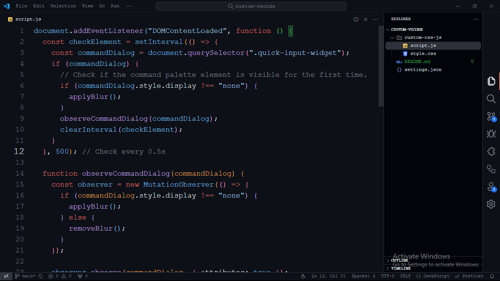
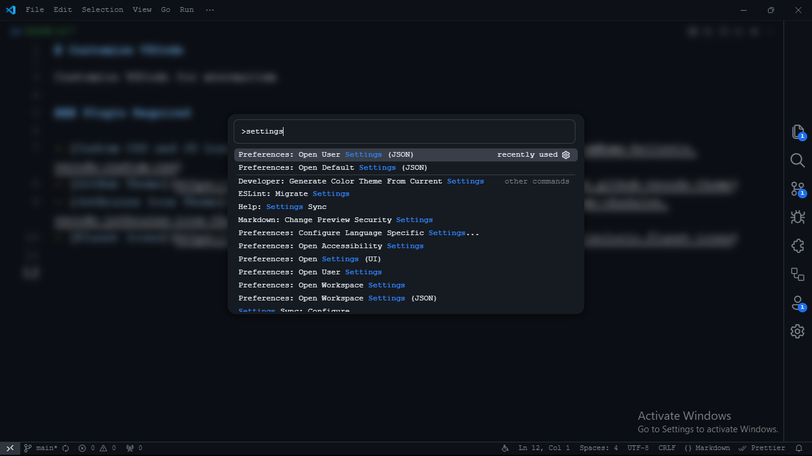

# Customize VSCode

Customize VSCode for minimalism.

### Screenshot




### Required Plugins

- [Custom CSS and JS Loader](https://marketplace.visualstudio.com/items?itemName=be5invis.vscode-custom-css)
- [GitHub Theme](https://marketplace.visualstudio.com/items?itemName=GitHub.github-vscode-theme)
- [JetBrains Icon Theme](https://marketplace.visualstudio.com/items?itemName=chadalen.vscode-jetbrains-icon-theme)
- [Fluent Icons](https://marketplace.visualstudio.com/items?itemName=miguelsolorio.fluent-icons)

### Tutorial

- Install the required plugins.
- Open the `settings.json` file by pressing `ctrl + shift + p` and typing `settings`
- Copy the entire code from the `settings.json` in this repository into your own `settings.json` file. You can modify it as needed.
- Copy the `custom-css-js` folder into your `.vscode` directory.
- Modify `settings.json` file and replace the paths with the correct directory for your custom VSCode setup.

```json
"vscode_custom_css.imports": [
    "file:///C:/.../vscode-custom/style.css",
    "file:///C:/.../vscode-custom/script.js"
]
```

- Press `ctrl + shift + p` and type "Reload Custom CSS and JS Loader" or restart your VSCode
